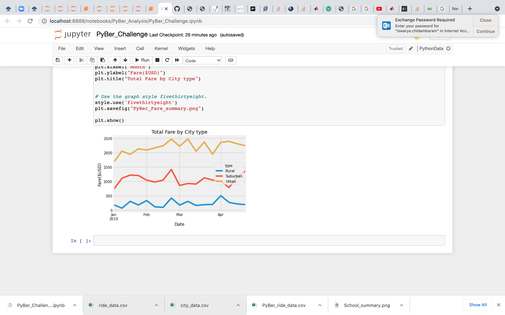

##  Overview of PyBer Analysis:
The purpose of this analysis is to create a summary DataFrame of the ride-sharing data by city type. Then, using Pandas and Matplotlib, a multiple-line graph is created that shows the total weekly fares for each city type. This analysis is to summarise how the data differs by city type and how those differences can be used by decision-makers at PyBer.

## Results:

#### *Overview* 

There are differences in ride-sharing data among the different city types. Ride-sharing data include the total rides, total drivers, total fares, average fare per ride and driver, and total fare by city type

#### *How is the total rides affected?* 

The total is the highest with the count of 1375 rides in Urban, 125 in rural and and 625 in Suburban. The number of rides in Suburban is 5 times more than the rural.

#### *How may drivers are there in each city type?*

The count of drivers is maximum with a count of 2405 in Urban and 78 in rural.

#### *What is the fare amount for each city type:*

The fare amount is the maximum in Urban with the amount of $39854 where as the fare amount is significantly lower in rural with the amount $4327.

#### *Average fare per ride by each city type:*

The average fare per ride in Urban is significantly lower when compared to average fare per ride in rural areas.
 
#### *Average fare per driver by each city type:*

Similarly the average per driver in Urban is significantly lower when compared to the average fare per driver in rural areas.

## Summary:

Recommendations based on disparities among the city types:

1. The fare per ride can be increased in Urban and reduced in rural so that there will be a decent amount for the drivers driving in urban areas. Now the drivers in Urban areas get less than 18 dollars.

2. The proportion of drivers in rural areas is more than in Urban areas. If possible, some drivers can move to urban areas so that the number of rides can be esily spread out.
 
3. We can have multiple taxis in different locations in rural areas so that people can make short trips insted of one long trip. That might increase the fare amount in rural areas

